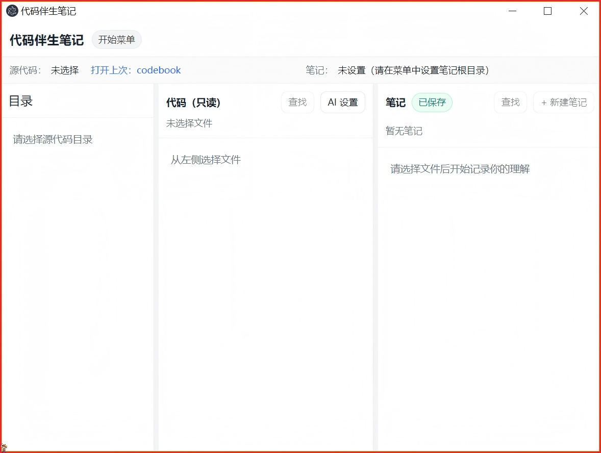
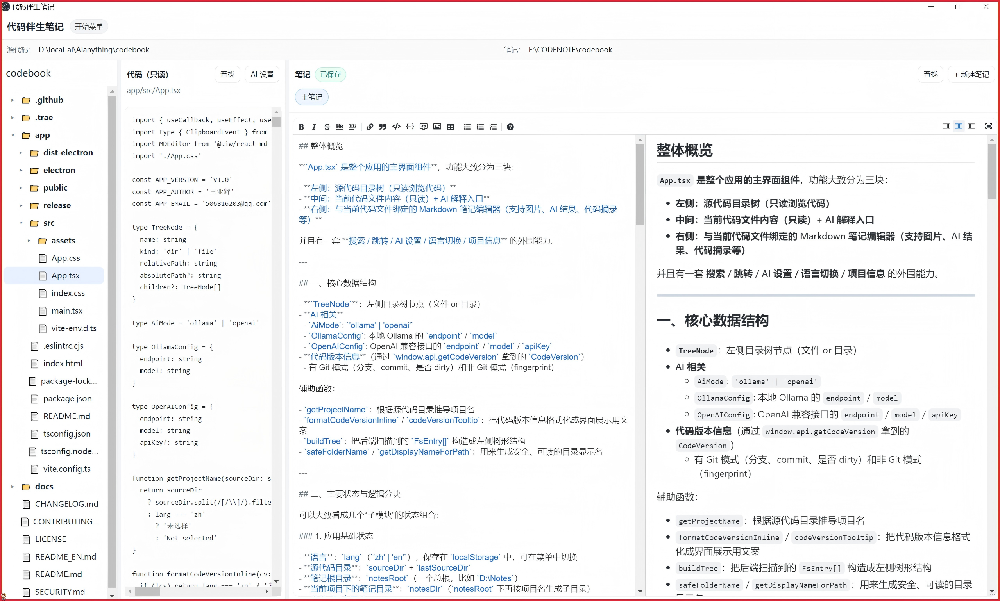
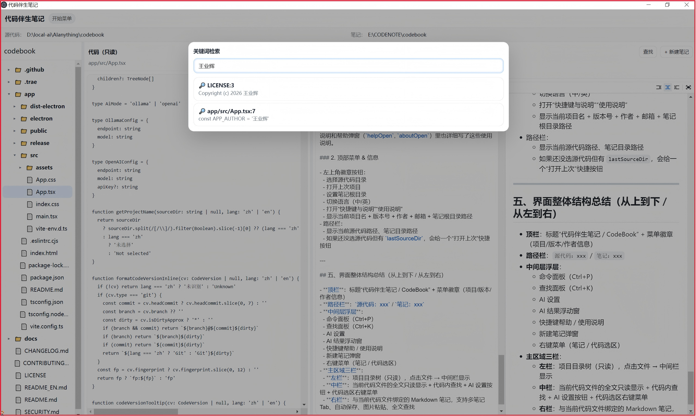
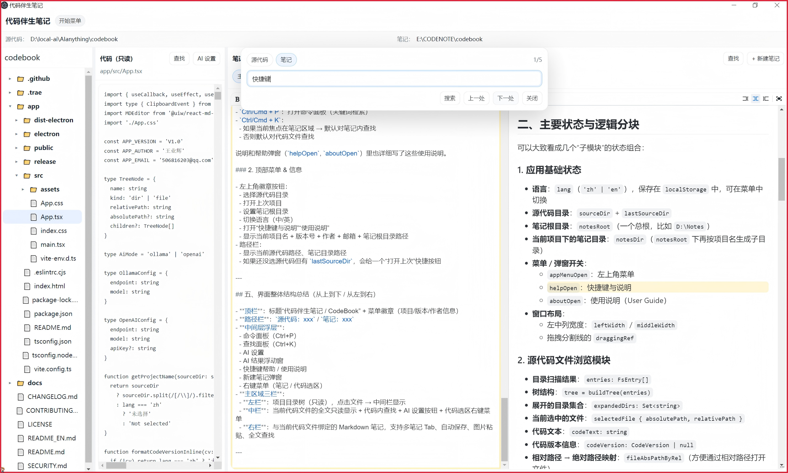
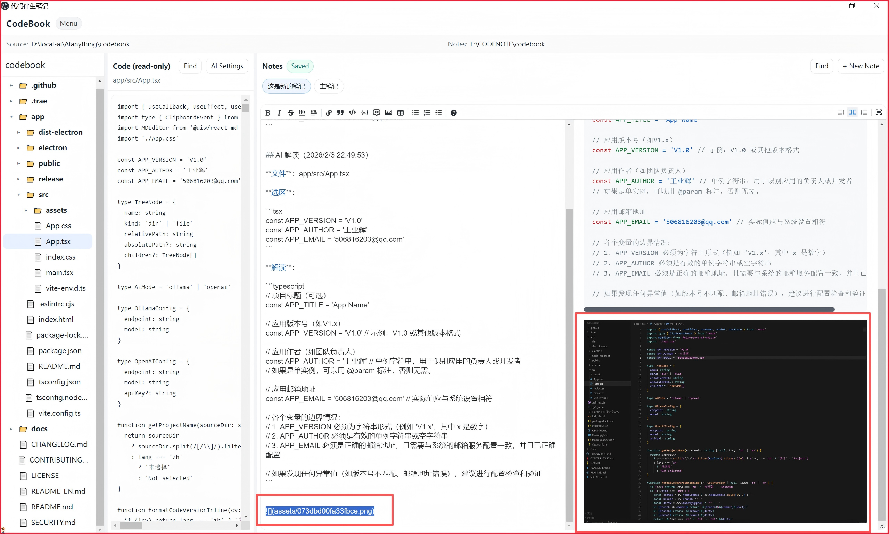
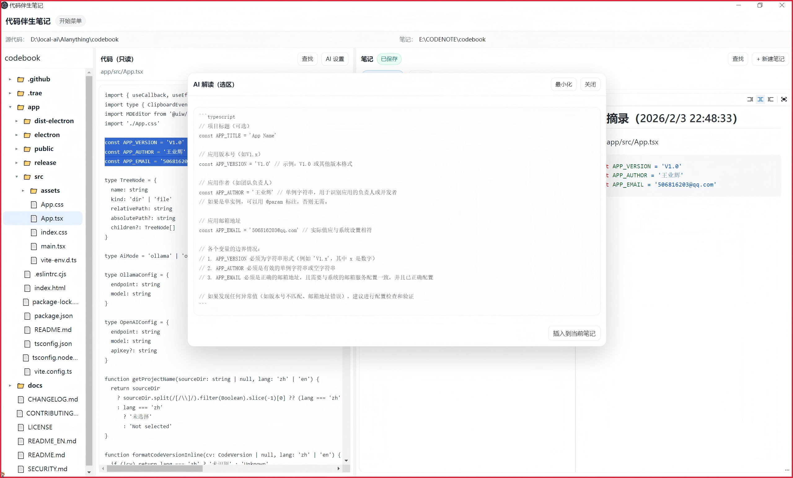
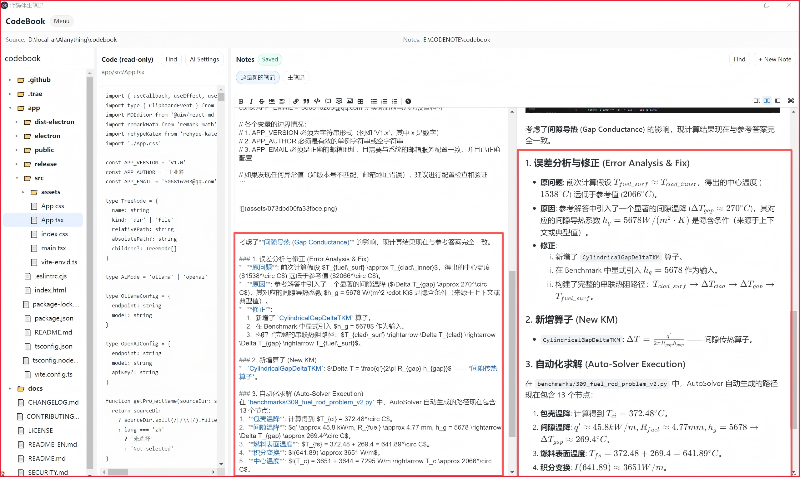
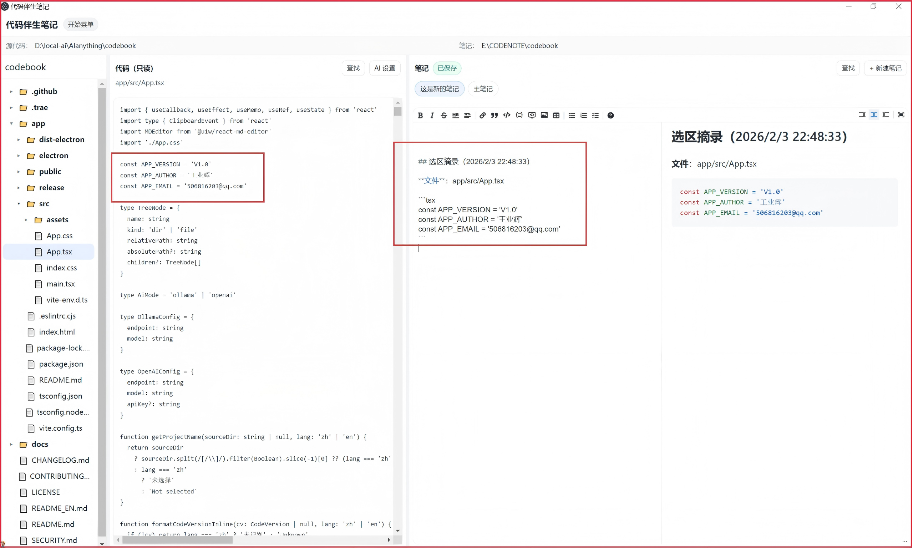

# 代码伴生笔记（CodeBook）

[](https://github.com/nscwangyehui-code/codebook/actions/workflows/ci.yml)
[](https://github.com/nscwangyehui-code/codebook/releases)
[](https://github.com/nscwangyehui-code/codebook/releases)
[](./LICENSE)
[](https://github.com/nscwangyehui-code/codebook/stargazers)

一款面向“读代码/学代码/分析理解项目”的本地桌面“代码伴生笔记“工具：左边是项目文件树，中间只读代码，右边是与源文件一一对应的 Markdown 笔记（笔记区是双栏-编辑区和预览区，支持插图、LaTeX 公式）。  
核心目标：**让你在不污染源代码、不反复切工具的情况下，把“理解代码的过程”沉淀成可检索的知识资产。**

> English README: [README_EN.md](./README_EN.md)

---

## 快速开始（只想先用）

1. 打开 Releases 下载 Windows 安装包：`代码伴生笔记-Windows-*-Setup.exe`
2. 安装后首次启动：
   - 先设置“笔记根目录”（放在源代码目录外）
   - 再选择“源代码目录”

---

## 截图 / Demo


- **启动界面**
  
- **三栏工作台（项目树 / 只读代码 / 伴生笔记）**  
  
- **Ctrl+P 关键词检索（定位相关文件/笔记）** 
  
- **Ctrl+K 文件内查找（上一处 / 下一处）**  
  
- **粘贴图片到笔记（自动保存到 assets/）**  
  
- **代码选区 → AI 解读 → 一键插入笔记**  
  
- **笔记选区 → LaTeX 公式 → 一键插入笔记**  
  
- **代码选区 → 源代码 → 一键插入笔记**  
  
## 这类痛点，你应该很熟

### 1) “代码里写注释”解决不了的事
- 注释适合解释“这段代码做什么”，但不适合记录“我为什么这样理解/有哪些坑/踩坑过程/截图/对比表格/长总结”
- 注释会污染仓库：PR 噪音、代码风格冲突、重构时注释过期、同事不敢删
- 注释里不能插图（架构图、流程图、截图），“理解成本”没法用图降低

### 2) 通用笔记软件对“代码笔记”不匹配
- 笔记结构和项目树脱节：你知道写在哪，但几天后就找不到“这条笔记对应哪个文件”
- 多项目切换时容易混：同名文件、同名模块、路径变化导致关联丢失
- 检索经常变成“全局大海捞针”，需要的是“先定位相关文件，再在文件内逐条跳转”

### 3) Vibe Coding / AI 编程带来的新问题
- Chat 里解释过的内容很快丢：对话不可复用、难检索、难回看
- Token 很贵：真正需要发给 AI 的往往只是**选区**，而不是整个文件/整个仓库
- 需要把 AI 解释“结构化”进笔记，而不是散落在聊天记录里

---

## 它解决什么问题

- **文件与笔记天然绑定**：笔记结构镜像项目树，某个文件的理解永远写回“它自己的位置”
- **不改源代码**：笔记强制存放在源代码目录外，不会污染仓库
- **插图友好**：直接在笔记区粘贴图片，自动落盘到 `assets/` 并插入 Markdown 引用
- **两段式检索体验**
  - `Ctrl+P`：全局关键词检索，找出“哪些源代码文件/哪些笔记”包含关键词
  - `Ctrl+K`：在当前文件/当前笔记内查找，支持“上一处/下一处”逐条跳转
- **AI 解读选区（省 Token）**：只把你选中的代码片段发给 AI；支持本地 Ollama 与 OpenAI 兼容接口；结果可一键插入当前笔记
- **代码版本可追溯**：顶部徽章显示 `branch@commit`（或非 Git 指纹），用于给笔记标记“当时对应的代码版本”

---

## 主要功能一览

- 三栏工作台：项目树｜只读代码｜伴生笔记（可拖拽调宽）
- 多笔记 Tab：同一源文件可有多个笔记（默认 `main.md`）
- 自动保存：编辑笔记自动去抖保存
- 粘贴图片：自动保存到 `assets/`，预览区直接显示
- 快捷键：
  - `Ctrl+P`：关键词检索（源代码 + 笔记）
  - `Ctrl+K`：文件内查找（当前源代码/当前笔记，上一处/下一处）
  - `Esc`：关闭面板
- 代码选区右键：
  - 插入到当前笔记
  - AI 解读选区（可拖动/可最小化面板）

---

## 使用方法（详细）

### 第一次启动
1. **设置笔记根目录（强烈建议先做）**  
   左上角徽章打开菜单 → “设置笔记根目录”  
   - 这个目录是你所有笔记的“仓库”，建议放在同步盘/备份盘
   - 软件会在笔记根目录下按“项目名”自动创建子目录

2. **选择源代码目录**  
   菜单 → “选择源代码目录”  
   选择你要阅读/学习的项目根目录（不要求是 Git 项目）

3. **开始阅读与记录**
   - 在左侧点击文件：中间显示只读代码，右侧显示该文件的伴生笔记区
   - 右侧点击 “+ 新建笔记”：为当前文件创建新笔记（默认也支持 `main.md`）

### 记录笔记（Markdown + 插图）
- 在右侧编辑区写 Markdown；右侧预览区实时渲染
- 直接在编辑区粘贴图片：会自动保存到笔记目录的 `assets/` 下，并插入 ``

### 全局检索（先定位相关文件/笔记）
1. 按 `Ctrl+P` 打开“关键词检索”
2. 输入关键词（建议至少 2 个字符）
3. 在结果列表中点击：
   - `🔎` 源代码命中：打开对应源文件
   - `📝` 笔记命中：打开对应源文件，并切换到对应笔记

> 典型用法：先用 `Ctrl+P` 确认“关键词出现在哪些文件/笔记”，再进入文件用 `Ctrl+K` 精确跳转每一处匹配。

### 文件内查找（逐条跳转）
1. 打开某个源文件/笔记后，按 `Ctrl+K`
2. 选择作用域：源代码 / 笔记
3. 输入关键词 → 点击“搜索”
4. 点击“下一处/上一处”（或 `Enter` / `Shift+Enter`）逐条跳转

### AI 解读选区（推荐本地 Ollama）
1. 在中间代码区选中一段代码 → 右键 → “AI 解读选区”
2. 首次使用先配置：
   - **Ollama（本地）**：填 endpoint（默认 `http://localhost:11434`）+ model（如 `qwen2.5-coder`）
   - **OpenAI 兼容**：填 endpoint + model + API Key
3. 解读结果支持“一键插入当前笔记”

---

## 部署/发布方式怎么选？
- 源码公开
- Release 放安装包

发布与更新日志：
- 更新日志见 [CHANGELOG.md](./CHANGELOG.md)
- Release 文案模板见 [.github/RELEASE_TEMPLATE.md](./.github/RELEASE_TEMPLATE.md)

---

## 配置要求

- **运行环境**：Windows 10/11（当前仓库已产出 Windows 安装包；其他系统可自行构建尝试）
- **硬件建议**：4GB+ 内存；更大的项目建议 8GB+
- **AI（可选）**
  - 本地 Ollama：需要自行安装 Ollama 并拉取模型
  - 云端模型：需要 OpenAI 兼容接口与 API Key

---

## 开发技术栈

- Electron（主进程 + 安全 IPC 白名单）
- Vite + React + TypeScript（渲染进程）
- @uiw/react-md-editor（Markdown 编辑/预览）
- gray-matter（笔记 Frontmatter）
- electron-builder（打包安装包）

---

## 隐私与安全

- **默认全本地**：笔记、图片资产都保存在你的磁盘；不做云同步、不做远程上传
- **AI 仅发送选区**：当你使用“AI 解读选区”时，只会把你选中的代码片段发送到你配置的 AI endpoint
- **API Key 本地保存**：仅存储在本地配置中，不会上传到任何作者服务器
- Electron 使用 `contextIsolation` + `sandbox`，仅暴露白名单 API（见 `app/electron/preload.ts`）

---

## 如何从源码运行 / 打包

```bash
cd app
npm install
npm run dev
```

构建（不打包）：
```bash
cd app
npm run build
```

打包（Windows）：
```bash
cd app
npm run package
```

---

## 开源协议

建议使用 MIT 协议（见 [LICENSE](./LICENSE)）。

---

## 贡献

欢迎提交 Issue / PR：功能建议、Bug 修复、文档完善都非常需要。  
贡献指南见 [CONTRIBUTING.md](./CONTRIBUTING.md)。
